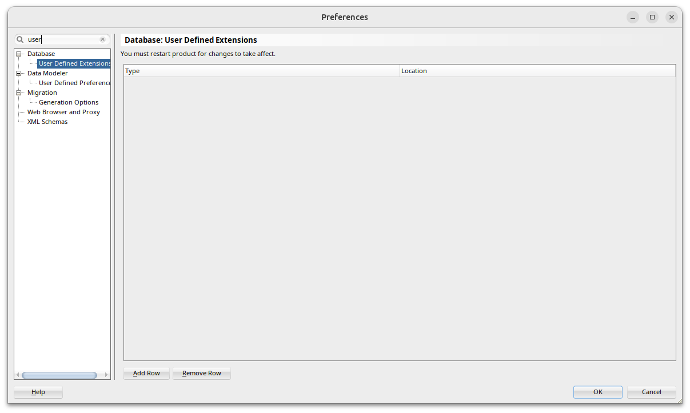
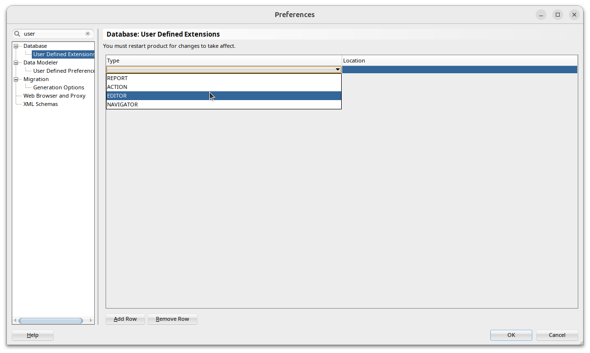
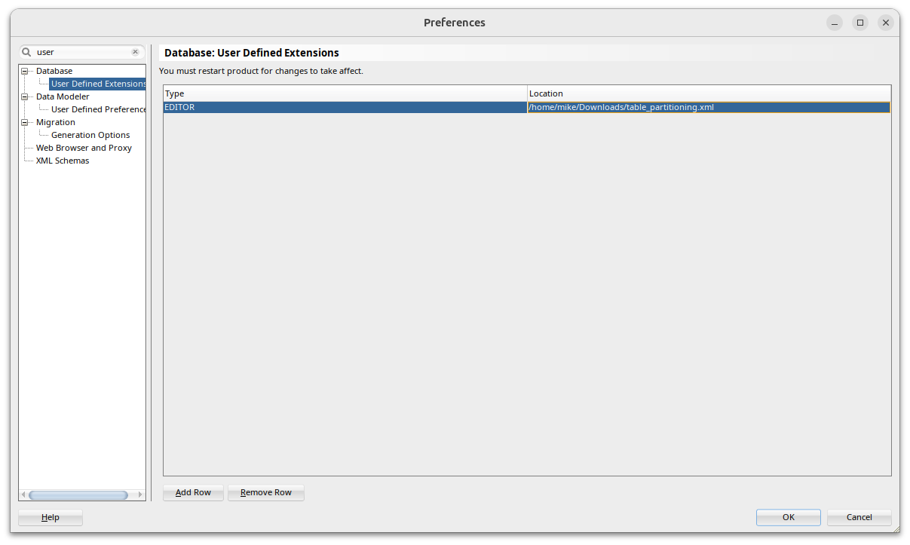
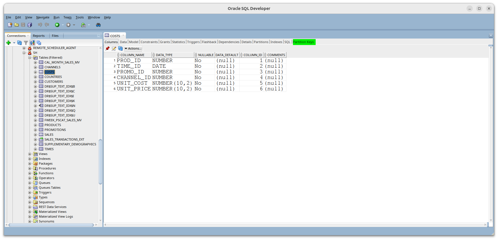
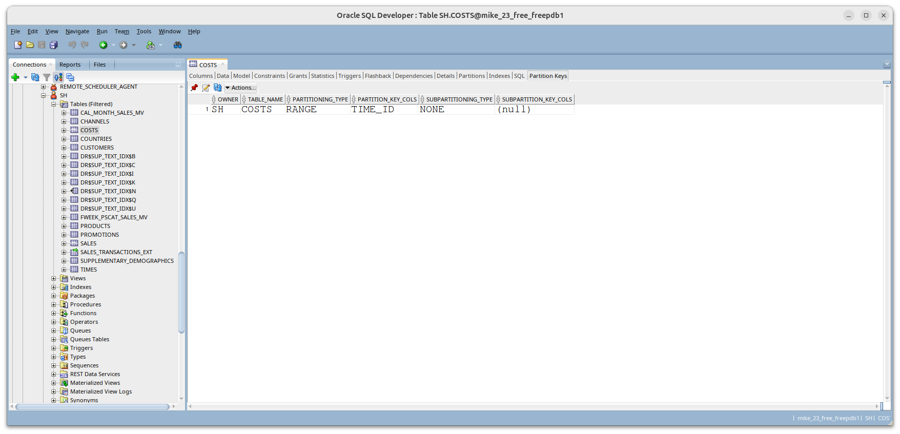

# Installing a Custom Tab in SQLDeveloper Classic

In SQLDeveloper select the **Tools** Menu then **Preferences**.

Search for User Defined Extensions

Click the **Add Row** button then click in the **Type** field and select *Editor* from the drop-down list

In the **Location** field, enter the full path to the xml file containing the extension you want to add

Hit **OK**

Restart SQLDeveloper. 
When you select an object of the type for which this extension is defined ( Tables in this example), you will see the new tab has been added

The new tab will work like any other :

